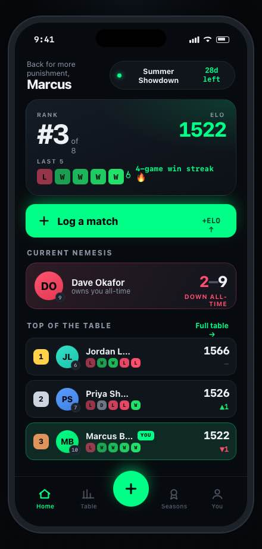

# OfficeFC

[](https://github.com/dbruza/officefc/actions/workflows/ci.yml)

OfficeFC turns an office EA SPORTS FC league into a proper competition. Players log
matches, opponents confirm results, and the app maintains ELO ratings, standings,
head-to-head records, season history, finals and cups.

It is an Expo and React Native app for web, iOS, and Android, backed by Firebase:
authentication, league data, private photo storage, trusted Cloud Functions, and scheduled
jobs.

<p align="center">
  
</p>

<p align="center"><em>The original home-screen design prototype that shaped the app.</em></p>

## Who it's for

OfficeFC is for a workplace, club, or group of friends who play EA SPORTS FC against each
other and want a ranked league that nobody has to keep in a spreadsheet.

It is distributed as a **self-hosted template**. Each group deploys its own copy to its
own Firebase project, so your league's data stays in an account you control. One
deployment runs one league; hosting several leagues from one deployment isn't supported
yet.

You need someone who is comfortable running a few terminal commands and has a Google
account. The recommended setup is the **web app** on Firebase Hosting, which players can
install to their home screen as a PWA. Native iOS and Android builds are possible but need
your own Apple and Google developer accounts and an Expo (EAS) account.

## Highlights

- Invite-only league with email verification, per-season join codes, and invite links
- Opponent-confirmed match logging; undisputed results auto-confirm after an hour
- Stats-aware seasonal ELO with form, streaks, rankings, and a "why the rating moved"
  breakdown
- Head-to-head records, match detail, season archives, awards, and player of the month
- End-of-season finals bracket, a mid-season knockout cup, and a finals prediction game
- League activity feed and per-match MVP voting
- Optional AI photo reading: snap the full-time stats screen and the app pre-fills the
  result for you to check (via [OpenRouter](https://openrouter.ai))
- Admin tools for seasons, teams, join codes, disputes, reports, and moderation
- Account deletion, report and block, and in-app privacy policy, terms, and support pages
- Push notifications for new results, confirmations, and reminders on native builds
- Optional Sentry crash reporting for the app and Cloud Functions

## Technology

| Area          | Stack                                                                    |
| ------------- | ------------------------------------------------------------------------ |
| App           | Expo 56, React Native, Expo Router, TypeScript                           |
| Backend       | Firebase Auth, Firestore, Storage, Cloud Functions (v2, Node.js 24)      |
| AI (optional) | Vision-model stats extraction and match analysis via OpenRouter          |
| Observability | Google Cloud Logging, optional Sentry (app and functions)                |
| Quality       | Node test runner, Firebase Rules Unit Testing, ESLint, Prettier          |
| Delivery      | Firebase Hosting (web/PWA), EAS (optional native builds), GitHub Actions |

## Architecture

```text
Expo app (web / iOS / Android)
  |
  +-- Firebase Auth -------- accounts and email verification
  +-- Firestore ------------ league, matches, ratings, seasons, read models
  +-- Cloud Storage -------- private match photos (AI photo logging only)
  +-- Cloud Functions ------ trusted writes, ELO, admin actions, AI extraction
  +-- Scheduled Functions -- reminders, auto-confirm, snapshots, cleanup
```

Clients can propose matches, but trusted outcomes are computed on the backend. A match
affects ELO only after opponent confirmation, auto-confirmation, or an audited admin
resolution. AI extraction only pre-fills the form; a player reviews the values before
submitting.

## Rating system

Ratings are a seasonal ELO (everyone starts at 1500 each season) computed deterministically
from confirmed matches in `functions/src/elo.ts`:

- **Stats-aware result.** A match result is a performance blend, not just the scoreline:
  goal margin (60%), shots on target (25%), and possession (15%). A side can win on the
  scoreboard yet earn little or lose rating if it was dominated on the underlying stats. Each
  match stores an `eloExplain` breakdown, surfaced in the app's "Why the rating moved" panel.
- **Team handicap.** When both teams' overalls are known, each overall point shifts the
  expected score by 12 ELO, so beating a stronger team is worth more.
- **Placement.** A player holds a ranked place only after `MIN_RANKED_GAMES` (3) games; before
  that they are provisional (no rank, can't take the title) and use a higher K-factor (40 vs
  32) for their first 10 games so new ratings settle faster.
- **Tie-breaks.** Equal ELO is broken by goal difference, then wins, then fewer games played,
  then a stable id.

## Deploy your own league

The full walkthrough, including costs and troubleshooting, is in
[docs/self-hosting.md](docs/self-hosting.md). In outline:

1. Create a Firebase project on the Blaze plan, enable Email/Password sign-in, Firestore,
   and Storage, and register a web app.
2. Fork or clone this repository, then select your project:

   ```bash
   npm ci && npm --prefix mobile ci && npm --prefix functions ci
   npx firebase login
   npx firebase use --add        # pick your project, alias "default"
   ```

3. Copy `mobile/.env.example` to `mobile/.env`, paste in your web app config, set
   `EXPO_PUBLIC_USE_EMULATORS=0`, and fill in your region, operator name, and support
   email.
4. Copy `functions/.env.example` to `functions/.env.<projectId>` and set
   `FUNCTIONS_REGION`, `ADMIN_EMAILS`, and `AI_FEATURES` (the first deploy asks for any you
   leave out).
5. Deploy the backend, then the web app:

   ```bash
   npm run deploy:backend        # Firestore and Storage rules, indexes, Cloud Functions
   npm run deploy:web            # production web build to Firebase Hosting
   ```

6. Sign up with an email from `ADMIN_EMAILS`, verify it, and press **Create league &
   join**. Then share the invite link from the admin dashboard.

## Run locally

Local development runs entirely against the Firebase Emulator Suite with the demo project
id `demo-officefc`. No Firebase account or credentials are needed.

Requirements: Node.js 24, npm, and Java 21 (for the emulators).

```bash
npm ci
npm --prefix mobile ci
npm --prefix functions ci
npm --prefix test/rules ci

cp mobile/.env.example mobile/.env    # works as-is for emulator development
npm --prefix functions run build      # the emulator runs the compiled functions
```

The emulators read their function parameters from the committed
`functions/.env.demo-officefc`, which makes `admin@office.test` the league admin once its
email is verified. To use a different address, override `ADMIN_EMAILS` in
`functions/.env.local` (gitignored).

Start the emulators in one terminal and the web app in another:

```bash
npx firebase emulators:start --project demo-officefc
npm --prefix mobile run web
```

Open the app, sign up as `admin@office.test`, verify the email, complete your
profile, and press **Create league & join**. No real verification email is sent; open the
link from the Emulator UI's Authentication tab (<http://localhost:4000>) or the emulator's
console output. Use `npm --prefix functions run build:watch` in a third terminal to pick up
backend changes.

Native development is available through `npm --prefix mobile run ios` and
`npm --prefix mobile run android`. Camera, uploads, and push notifications need the
real-device workflow in [docs/real-device-testing.md](docs/real-device-testing.md).

## Configuration

Nothing deployment-specific is hard-coded. Settings live in gitignored files on the machine
you deploy from, in Firebase Secret Manager, and (for native builds) in EAS:

| Where                         | Setting                                | Purpose                                                     |
| ----------------------------- | -------------------------------------- | ----------------------------------------------------------- |
| `npx firebase use --add`      | active project (`.firebaserc`)         | Which Firebase project the deploy scripts target            |
| `functions/.env.<projectId>`  | `FUNCTIONS_REGION`                     | Region for every Cloud Function (default `us-central1`)     |
|                               | `ADMIN_EMAILS`                         | Emails that become admins on first join, without a code     |
|                               | `AI_FEATURES`                          | Deploy the AI photo-reading and match-analysis functions    |
|                               | `SENTRY_DSN`                           | Optional Sentry reporting for functions                     |
| Firebase Secret Manager       | `OPENROUTER_API_KEY`                   | OpenRouter key, only when `AI_FEATURES=true`                |
| `mobile/.env`                 | `EXPO_PUBLIC_FIREBASE_*`               | Your Firebase web app config (six values)                   |
|                               | `EXPO_PUBLIC_USE_EMULATORS`            | `1` for local development, `0` for deployed builds          |
|                               | `EXPO_PUBLIC_FUNCTIONS_REGION`         | Must equal `FUNCTIONS_REGION`                               |
|                               | `EXPO_PUBLIC_AI_FEATURES`              | Must match `AI_FEATURES`; hides AI features when `0`        |
|                               | `EXPO_PUBLIC_SUPPORT_EMAIL`            | Contact shown on /privacy, /terms, and /support             |
|                               | `EXPO_PUBLIC_OPERATOR_NAME`            | Who runs this deployment, named in the privacy policy/terms |
|                               | `EXPO_PUBLIC_DATA_LOCATION`            | Optional; where Firestore lives, as the privacy policy says |
|                               | `EXPO_PUBLIC_WEB_URL`                  | Optional public URL for invite links from native apps       |
| EAS environment (native only) | `OFFICEFC_BUNDLE_ID`, `OFFICEFC_EAS_*` | Bundle id and Expo project for native builds                |

`npm run validate:web-env` (run automatically by `build:web` and `deploy:backend`) checks
that `mobile/.env` is complete, that it points at the active Firebase project, and that its
region and AI settings agree with `functions/.env.<projectId>`. The
[self-hosting guide](docs/self-hosting.md#configuration-reference) lists every setting.

## Quality checks

```bash
npm run format:check       # formatting
npm run lint               # zero-warning lint
npm run typecheck:mobile   # cache-clean mobile TypeScript check
npm run build:web          # production Expo export and environment validation
npm run test:functions     # Cloud Functions tests
npm test                   # extraction and ELO tests
npm run test:rules         # Firestore and Storage security rules
```

`npm run check` runs the complete local CI sequence.

## Project layout

```text
mobile/                 Expo application (web, iOS, Android)
functions/              Firebase Cloud Functions and backend tests
test/                   extraction, ELO, and security-rules tests
eval/                   labelled AI extraction evaluation harness
scripts/                build, validation, versioning, and test helpers
data/                   source list for the bundled team catalogue
docs/                   self-hosting guide, Firebase reference, runbooks, design history
prototype/officefc/     original visual prototype and design references
firebase.json           Hosting, Functions, and emulator configuration
firestore.rules         Firestore authorization boundary
storage.rules           private match-photo authorization boundary
```

The standalone HTML under `prototype/officefc/` is kept as design history. It is not the
production app or a deployment target.

## Documentation

- [Self-hosting guide](docs/self-hosting.md): deploy and run your own league
- [Firebase backend reference](docs/firebase-setup.md): services, logging, read models
- [Web release runbook](docs/web-mvp-launch.md): verify, deploy, smoke-test, roll back
- [Real-device testing](docs/real-device-testing.md): native builds on physical phones
- [AI extraction eval](eval/README.md): measure photo-reading accuracy
- [Design history](docs/design/README.md) and [maintainer runbooks](docs/maintainers/README.md)

## Contributing

Contributions are welcome. Read [CONTRIBUTING.md](CONTRIBUTING.md) for the development
setup and pull request process, and the [Code of Conduct](CODE_OF_CONDUCT.md). Report
security issues privately as described in [SECURITY.md](SECURITY.md). For help running your
own league, use [GitHub Discussions](https://github.com/dbruza/officefc/discussions).

## License

OfficeFC is released under the [MIT License](LICENSE). Each deployment is run by its own
operator, who is responsible for that deployment's data, privacy policy, and terms.

## Trademarks

OfficeFC is an independent project and is not affiliated with, endorsed by, or sponsored
by Electronic Arts Inc. EA SPORTS FC is a trademark of Electronic Arts Inc. Club names and
team ratings in the bundled team catalogue are included for identification only.
